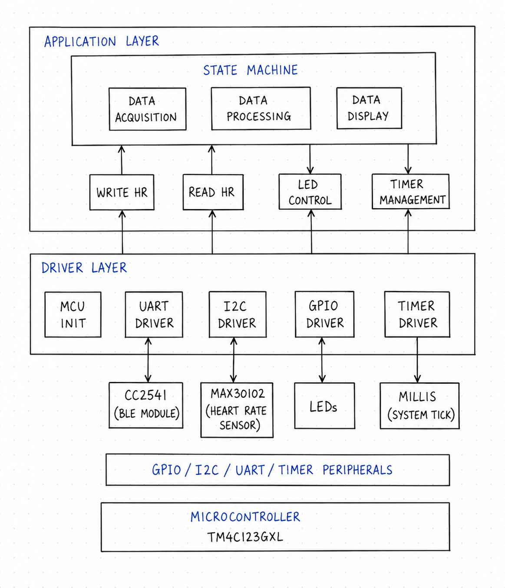

# TM4C123GXL BLE Heart Rate Monitor

## Overview

This project is an embedded firmware project for a heart-rate monitoring system using the TM4C123GXL microcontroller. The system reads heart-rate data from a MAX30102 heart-rate sensor over I2C, sends the heart-rate data to a laptop through a CC2541 BLE 4.0 Bluetooth module over UART, and controls LEDs based on the measured heart-rate range.

The goal of this project is to develop a wearable heart-rate monitoring device. The current phase focuses on implementing and testing the firmware drivers for GPIO, UART, I2C, timers. Eventually for integrating MAX30102 sensor, BLE communication.

This project will eventually integrate sensor acquisition, heart-rate processing module, Bluetooth data transmission, LED status indicator, and wearable device packaging.
## Hardware

- TM4C123GXL LaunchPad
- MAX30102 heart-rate sensor
- CC2541 BLE 4.0 Bluetooth module
- LEDs
- Laptop / BLE receiver

## Firmware Architecture

## Driver Progress

- [x] GPIO Driver
- [x] UART Driver
- [ ] I2C Driver
- [ ] MAX30102 Driver
- [ ] Heart Rate Algorithm
- [ ] BLE Communication
- [ ] Final Integration
